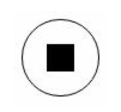
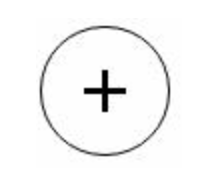
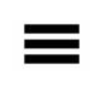
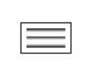
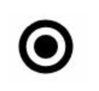
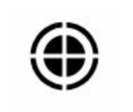
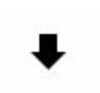
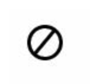

# CSS绘制图标
### 1. 暂停按钮


```
.box{
    width: 50px;
    height: 50px;
    background-color: white;
    border: 1px solid black;
    border-radius: 100%;
    outline: 10px solid black;
    outline-offset: -27px;
    cursor: pointer;
}
```
### 2. 加号按钮 


```
.box{
    width: 50px;
    height: 50px;
    background-color: white;
    border: 1px solid black;
    border-radius: 100%;
    outline: 10px solid black;
    outline-offset: -35px;
    cursor: pointer;
}
```
### 3. 关闭按钮 


```
.box{
    width: 50px;
    height: 50px;
    background-color: black;
    border: 1px solid white;
    border-radius: 100%;
    outline: 15px solid white;
    outline-offset: -39px;
    cursor: pointer;
    transform: rotate(45deg);
}
```
### 4. 菜单按钮


##### 1) 用阴影实现
```
.box{
    width: 30px;
    height: 0;
    color: black;
    box-shadow: 20px 10px 0 3px ,20px 0 0 3px ,20px 20px 0 3px;
}
```
##### 2) 用背景裁剪实现
```
.box{
    width: 30px;
    height: 5px;
    padding: 5px 0;
    border-top: 5px solid black;
    border-bottom: 5px solid black;
    background-clip: content-box;
    background-color: black;
}
```
##### 3) 用渐变函数实现
```
.box{
    width: 30px;
	height: 15px;
	background: linear-gradient(to bottom,black 0%,black 0%,transparent 20%,transparent 40%, black 40%,black 40%,transparent 60%,transparent 80%,black 100%);
}
```
### 5. 文章图标


```
.box{
    width: 30px;
    height: 15px;
    background: linear-gradient(to bottom,black 0%,black 0%,transparent 20%,transparent 40%, black 40%,black 40%,transparent 60%,transparent 80%,black 100%);
    outline: 1px solid black;
    outline-offset: 4px;
}
```
### 6. 单选按钮


```
.box{
    width: 16px;
    height: 16px;
    background-color: black;
    border-radius: 100%;
    box-shadow: 0 0 0 5px #fff,0 0 0 10px #000;
}
```
```
.box{
    width: 16px;
    height: 16px;
    padding: 7px;
    border: 3px solid green;
    border-radius: 100%;
    background-clip: content-box;
    background-color: green;
}
```
### 7. 靶子图标


```
.box{
    width: 16px;
    height: 16px;
    background-color: black;
    border-radius: 100%;
    box-shadow: 0 0 0 3px #fff,0 0 0 5px #000;
    outline: 18px solid #ffffff;
    outline-offset: -25px;
    transform: scale(1.5);
}
```
### 8. 田字图标


```
.box{
    width: 0;
    color: #000;
    border: 3px solid black;
    outline: 6px dotted ;
    outline-offset: 6px;
}
```
```
.box{
    width: 0;
    padding: 3px;
    background-color: black;
    outline: 6px dotted black;
    outline-offset: 6px;
}
```
```
.box{
    height: 6px;
    width: 6px;
    background-color: black;
    outline: 6px dotted black;
    outline-offset: 6px;
}
```
### 9. 下载箭头


```
.box{
    width: 0;
    color: #000;
    border: 8px solid transparent;
    border-top: 8px solid;
    box-shadow: 0 -12px 0 -4px;
}
```
### 10. 下载箭头(带横线)
.png)

```
.box{
    width: 1px;
    height: 6px;
    color: #000;
    border: 8px solid transparent;
    border-top: 8px solid;
    box-shadow: 0 -12px 0 -4px;
    background: linear-gradient(to bottom,#ffffff 50%,#000000 50%) repeat-x;
}
```
### 11. 禁用图标


```
.box{
    width: 20px;
    height: 20px;
    border-radius: 100%;
    border: 2px solid #000000;
    background: linear-gradient(to right,#ffffff 45%,#000000 45%,#000 55%,#fff 55%);
    transform:rotate(40deg);
}
```
