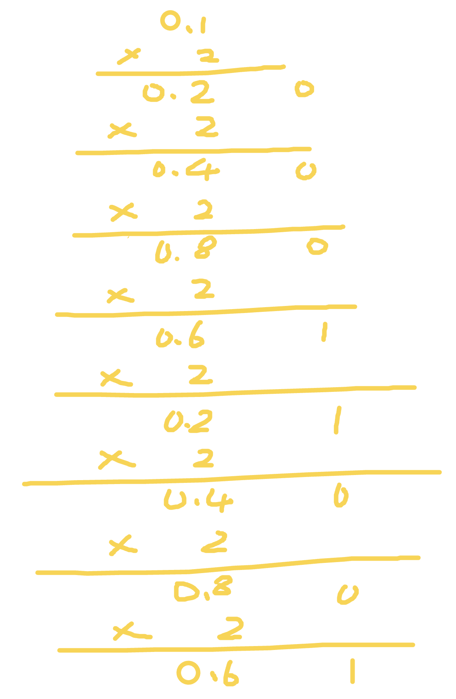

真是棒 我也遇到了 "0.1 + 0.2 != 0.3" 的问题

因为 JS 采用 IEEE 754 双精度版本（64位），并且只要采用 IEEE 754 的语言都有该问题。
IEEE 754 双精度：六十四位中符号位占一位，整数位占十一位，其余五十二位都为小数位。

因为 0.1 和 0.2 都是无限循环的二进制了，所以在小数位末尾处需要判断是否进位（就和十进制的四舍五入一样）。

我们都知道计算机表示十进制是采用二进制表示的，所以 0.1 在二进制表示为

// (0011) 表示循环
0.1 = 2^-4 * 1.10011(0011)
0.2 = 2^-3 * 1.10011(0011)
加起来的到 0.30000000000000004

解决方法
parseFloat((0.1 + 0.2).toFixed(10))