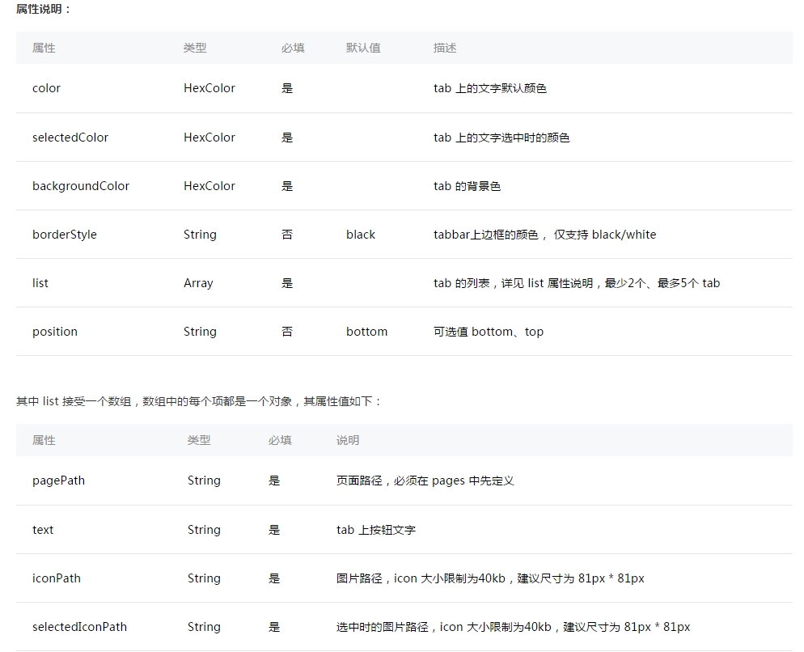
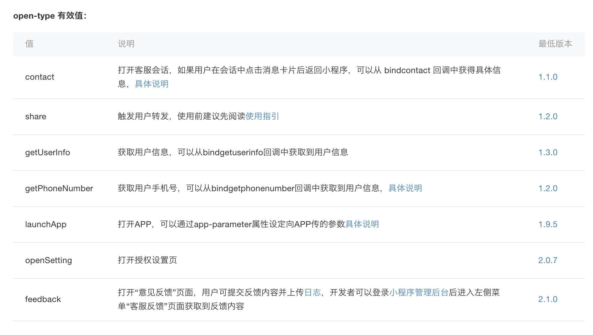
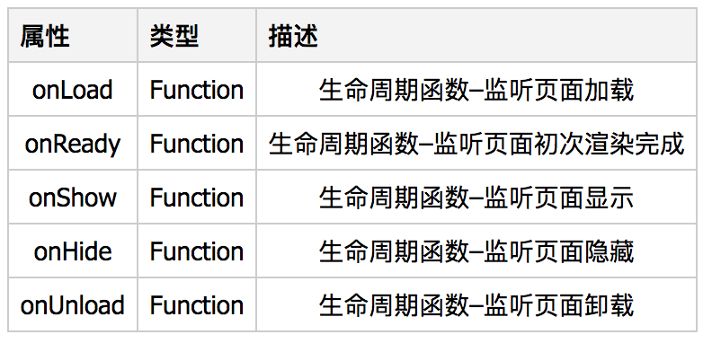

# 微信小程序

###1. 通过点击进行页面跳转

> 首先确保在 app.json 的 pages 中存在

	"pages": [
		"pages/index",
		"pages/home/home",
		"pages/list/list",
		"pages/me/me",
		"pages/logs/logs"
	]

> 其次在页面中给按钮绑定事件

	<button class="btn" bindtap="goPageList">选择</button>

> 申明事件

	goPageList() {
		wx.navigateTo({
			url: './list/list',
			success: function(res) {},
			fail: function(err) {}
		});
	}

> 通过以上可以实现普通页面间的跳转，但若是需要跳转到的是 tabbar page ，那就会报错 "navigateTo:fail can not navigateTo a tabbar page"，需要换个写法

	goPageList() {
		wx.switchTab({
			url: './list/list',
			success: function(res) {},
			fail: function(err) {}
		});
	}

> 这样就OK了

### 2. 使用 wx.switchTab 进行页面跳转时是不支持带参数的

	wx.switchTab: url 不支持 queryString

### 3. Page 方法
	Page({
		data: {
			key1: value1
		}
	})

> data 里面的数据不能像在 vue 中直接 this.key1，需要 this.data.key1，否则会拿到一个 undefined

### 4. 每个 wxss 文件里面的样式都只针对同级里面生效，如果有公用样式需要写在 app.wxss 里面

### 5. 导航栏

> navigationBarBackgroundColor 导航栏背景颜色，如”#000000”

> navigationBarTextStyle 导航栏标题颜色，仅支持 black/white

> navigationBarTitleText 导航栏标题文字内容

> backgroundColor 窗口的背景色

> backgroundTextStyle 下拉背景字体、loading 图的样式，仅支持 dark/light

> enablePullDownRefresh 是否开启下拉刷新，详见页面相关事件处理函数


### 6. app.json
> tabBar 的属性 borderStyle 仅支持 black/white
	



### 7. wxml 文件中使用 js 文件中的方法
	<view style="background-image: url({{getImgUrl(media)}})"></view>

> 按上面那样写是出不了结果的，只能在 js 文件中先处理好数据，然后再进行 setData


```
this.setData({
	imgUrl: media_url + media
});
```

	<view style="background-image: url({{imgUrl}})"></view>
	
### 8. navigateBack
> 从A页面去到B页面 再从B页面去到C页面 然后从C页面直接返回A页面

	wx.navigateTo('B');
	wx.navigateTo('C');
	
> 如果直接写 wx.navigateBack('A') 是无效的 需要如下写法
	
	wx.navigateBack({
		delta: 2  // 这个代表需要返回的层数
	});
	
### 9. 权限相关
##### 地理位置
```
wx.getSetting({
	success: (res) => {
		// console.log(JSON.stringify(res))
		// res.authSetting['scope.userLocation'] == undefined    表示 初始化进入该页面
		// res.authSetting['scope.userLocation'] == false    表示 非初始化进入该页面,且未授权
		// res.authSetting['scope.userLocation'] == true    表示 地理位置授权

		if (res.authSetting['scope.userLocation'] == undefined || res.authSetting['scope.userLocation'] == true)
			return resolve();

		wx.showModal({
			title: '请求授权当前位置',
			content: '需要获取您的地理位置，请确认授权',
			success(res) {
				console.log(res)
				if (res.cancel) {
					wx.showToast({
						title: '拒绝授权',
						icon: 'none',
						duration: 1000
					});
				} else if (res.confirm) {
					wx.openSetting({
						success(dataAu) {
							if (dataAu.authSetting["scope.userLocation"] == true) {
								wx.showToast({
									title: '授权成功',
									icon: 'success',
									duration: 1000
								});
								return resolve();
							}
							wx.showToast({
								title: '授权失败',
								icon: 'none',
								duration: 1000
							});
						}
					});
				}
			}
		});
	}
});
```
> 如果你以为用户信息相关的设置也是这么去弄的 那你就错了  
> 需要获取用户信息的话 需要通过绑定按钮的 open-type 然后从绑定在bindgetuserinfo 的函数中获取

```
<button open-type="getUserInfo" bindgetuserinfo="getUserInfo">获取</button>
```
```
getUserInfo(e) {
	console.log(e.detail.userInfo);
}
```
还有一些 open-type 


### 10. 生命周期


### 11. 图片缓存

> 由于页面列表有太多远端图片，如果每次进入页面都重新去拉去这些远端图片显然是不行的，原因如下：  
```
1) 图片过多过大会导致页面整个卡顿，甚至出现很多白屏
2) 总是去加载远端资源是需要花费流量的 流量都是money啊
3) 。。。
```

> 一开始想着图片加载完成后可以拿到整个图片资源，在把这个资源转成base64存起来，后面发现，很显然，这个方法真的很笨  

> 正确做法：  
```
1) 通过 wx.getImageInfo 可以拿到远端图片的临时本地路径 path
2) 通过 wx.setStorageSync 把每个 mediaId 跟 path 对应的存在本地
3) 再次遇到这个 mediaId 时就直接拿到那个本地路径，本地图片基本是秒开
```

> ps: 通过 image 标签的 bindload 方法是拿不到图片资源的，他只会返回 width, height  