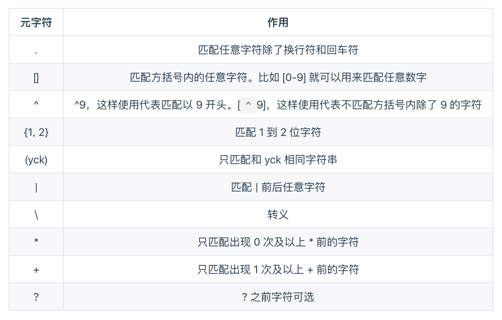
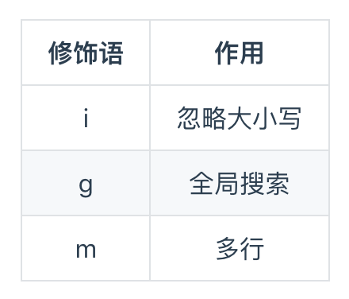
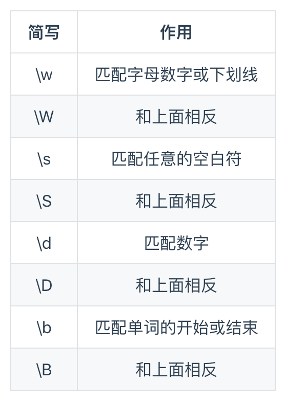

# 正则匹配

### 1. 元字符


### 2. 修饰语


### 3. 字符简写


```
let reg;
reg.test(string) // true为匹配上了

手机号码: /^((13[0-9])|(14[5,7])|(15[0-3,5-9])|(17[0,3,5-8])|(18[0-9])|166|198|199|147)\d{8}$/
电话号码: /^(\d{3,4}-)?(\d{7,14})+(-\d{1,4})?$/
数字: /^\d+(\.\d*)?$/
邮箱: /^\w+([-+.]\w+)*@\w+([-.]\w+)*\.\w+([-.]\w+)*$/
```

### 4. 隐藏手机号中间4位
```
str.replace(/(\d{3})(\d{4})/, '$1****')
```
